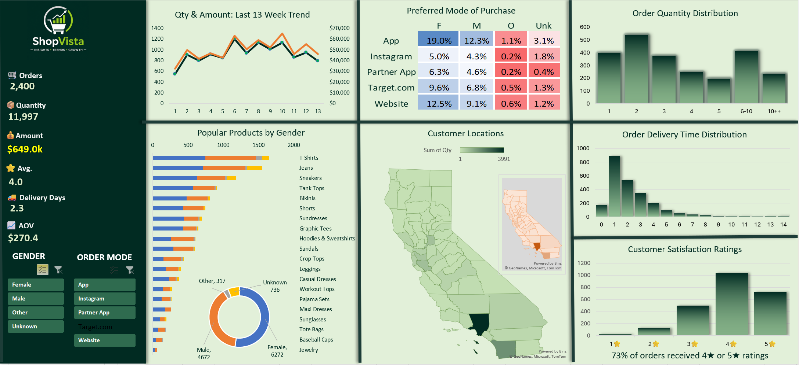

# Excel E-Commerce Dashboard

## About This Project

I created this dashboard while learning data analytics and Excel dashboarding.
I wanted to take a raw e-commerce dataset and turn it into something that could answer business questions at a glance. Instead of looking through rows of data the dashboard makes it easier to understand sales trends, customer behaviour and product performance.

## Dashboard Preview

## Dashboard Walkthrough Video
Click below to view the dashboard recording.
[▶ Dashboard Recording](dashboardrecording.mp4)

## About the Dataset
The original dataset contained 2,400 records and 12 columns. While working on this project I added calculated columns such as Week Number, Days to Deliver and Gender Value.
Using this data, I explored how customers buy, which products sell the most and how delivery and ratings are performing.

## Questions I Tried to Answer
- Are sales increasing or decreasing over time?
- Which order mode do customers prefer?
- Which products are selling the most?
- How many items do customers usually buy in one order?
- How long does delivery take?
- Are customers happy with their purchases?
- Which locations generate the most orders?

## My Findings
- Around 73% of orders received 4★ or 5★ ratings which indicates overall positive customer satisfaction.
- Most customers purchased between 1 and 3 items per order.
- T-Shirts and Jeans were among the highest-selling products.
- App and Website were the most preferred purchase channels.
- A large number of orders were delivered within 1 to 3 days.
- Sales and quantity showed fluctuations across the 13-week period.
  
## Dashboard Highlights
- Sales and revenue trend for the last 13 weeks
- Purchase mode comparison
- Product sales breakdown by gender
- Customer location map
- Delivery time distribution
- Customer rating analysis
- Interactive slicers for filtering data

## Tools Used
- Microsoft Excel
- Pivot Tables
- Pivot Charts
- Slicers
- Conditional Formatting
- Map Chart

## What I Learned
While building this project I got hands-on practice with Pivot Tables, Pivot Charts, slicers and dashboard design.
More important, I learned how to start with business questions first and then choose the right charts and KPIs to answer them.
